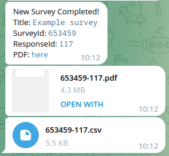
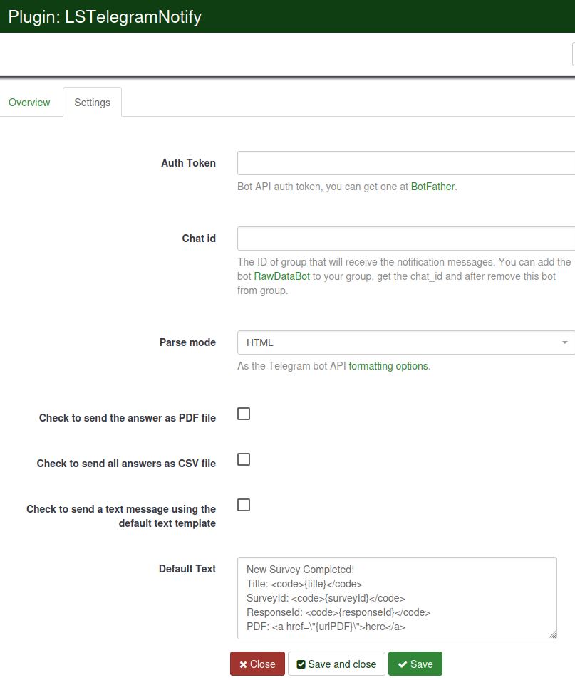

# LimeSurvey LSTelegramNotify Plugin

The Limesurvey LSTelegramNotify plugin allows you to send after Survey event to Telegram.

## Plugin Installation

- Copy the LSTelegramNotify folder to the Limesurvey "plugins" directory.
- Go to `LSTelegramNotify` folder
- Run `composer install` inside of folder `LSTelegramNotify`
- Activate the plugin at the Limesurvey plugin manager (requires proper user rights for accessing the feature at the Limesurvey admin interface).
- Configure the plugin at the settings page

### Custom settings by survey
You can add custom settings by survey to send the messages to other groups, customize the text and change other settings.

- Go to survey settings
- GO to `Simple plugins`
- Define your custom settings at `Settings for plugin LSTelegramNotify `
