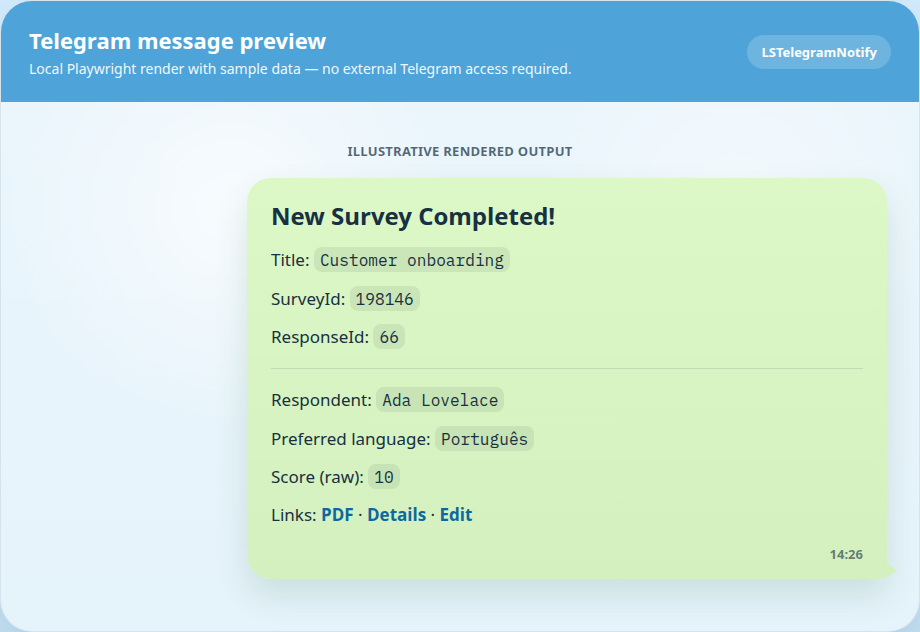
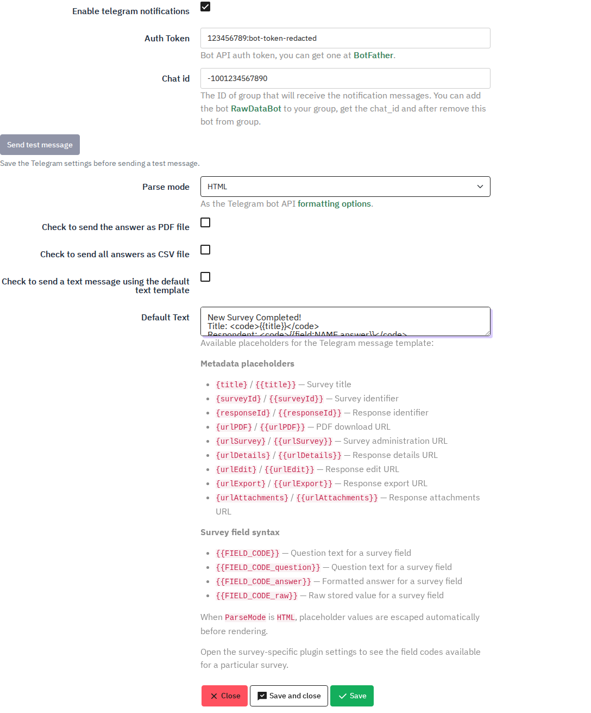

# LimeSurvey LSTelegramNotify Plugin

The LimeSurvey `LSTelegramNotify` plugin sends survey completion notifications to Telegram.

Useful improvements inspired by the `LSTelegramNotifyPlus` fork and now available here include:

- global/per-survey `Enable` switch for notifications
- HTML-safe rendering when using `ParseMode = HTML`
- plain `Text` mode without Telegram `parse_mode`
- extra URL placeholders for common survey/response actions
- mustache placeholders for survey question/answer/raw values

The image below is a locally generated preview of a rendered Telegram message using sample data:

## Plugin Installation

- Copy the LSTelegramNotify folder to the Limesurvey "plugins" directory.
- Go to `LSTelegramNotify` folder
- Run `composer install` inside of folder `LSTelegramNotify`
- Activate the plugin at the Limesurvey plugin manager (requires proper user rights for accessing the feature at the Limesurvey admin interface).
- Configure the plugin at the settings page

## Available placeholders

### Metadata placeholders

These placeholders work in both legacy and mustache syntax:

- `{title}` / `{{title}}`
- `{surveyId}` / `{{surveyId}}`
- `{responseId}` / `{{responseId}}`
- `{urlPDF}` / `{{urlPDF}}`
- `{urlSurvey}` / `{{urlSurvey}}`
- `{urlDetails}` / `{{urlDetails}}`
- `{urlEdit}` / `{{urlEdit}}`
- `{urlExport}` / `{{urlExport}}`
- `{urlAttachments}` / `{{urlAttachments}}`

When `ParseMode` is `HTML`, all placeholder values are escaped before rendering so survey content cannot break the markup.

### Survey field placeholders

Use field codes in mustache syntax to inject survey questions and responses:

- `{{field:FIELD_CODE.question}}`
- `{{field:FIELD_CODE.answer}}`
- `{{field:FIELD_CODE.raw}}`

Shorthand aliases are also available:

- `{{FIELD_CODE}}`
- `{{FIELD_CODE_answer}}`
- `{{answer_FIELD_CODE}}`
- `{{raw_FIELD_CODE}}`

The global plugin settings screen documents the available placeholders directly in the UI:

### Custom settings by survey
You can add custom settings by survey to send the messages to other groups, customize the text and change other settings.

- Go to survey settings
- GO to `Simple plugins`
- Define your custom settings at `Settings for plugin LSTelegramNotify `

## Updating documentation screenshots

The repository includes a Playwright-based command to refresh the documentation screenshots.

- `img/settings.png` is captured from the LimeSurvey admin interface with sensitive values masked before the screenshot is saved.
- `img/telegram_example.png` is generated locally as an illustrative preview using sample data, so no Telegram access is required.

To regenerate the images:

1. Copy `.env.example` to `.env` and adjust the LimeSurvey admin credentials for your local environment.
2. Install the Node dependencies with `npm install`.
3. Install the Chromium browser used by Playwright with `npm run playwright:install`.
4. Run `npm run screenshots:update`.

If you prefer not to edit `.env`, you can also override the credentials inline when running the command.
